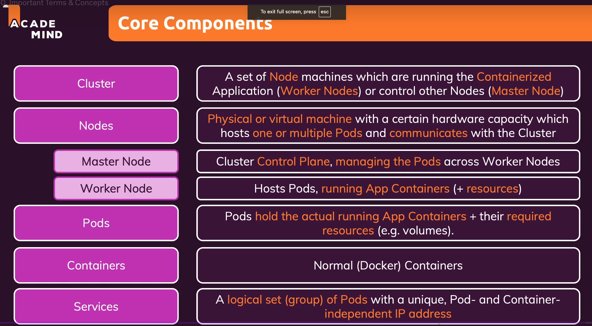

# Kiến trúc và Khái niệm Cốt lõi của Kubernetes

## 1. Pod

Pod là đơn vị nhỏ nhất trong Kubernetes. Mỗi pod chứa ít nhất một container và có thể chứa nhiều container cần làm việc cùng nhau.

Pod sẽ chạy trên các worker nodes, nơi container thực sự được thực thi.

## 2. Worker Node

Worker node là các máy chủ (có thể là máy ảo hoặc máy vật lý) nơi Kubernetes chạy các pod.

Các worker node cần có:
- CPU và bộ nhớ để chạy các pod
- Khả năng chạy nhiều pod trên cùng một node
- Kết nối mạng để giao tiếp với các node khác

## 3. Proxy

Kubernetes sử dụng proxy để kiểm soát lưu lượng mạng của các pod trên worker node.

Proxy có các chức năng:
- Kết nối các pod với internet
- Đảm bảo lưu lượng từ người dùng đến đúng container
- Cân bằng tải giữa các pod
- Quản lý kết nối mạng nội bộ

## 4. Master Node và Control Plane

Master node (hoặc control plane) điều khiển và quản lý toàn bộ cluster.

Các thành phần chính:
- API Server: Điểm giao tiếp chính cho tất cả các hoạt động
- Scheduler: Phân bổ pod vào các worker node
- Controller Manager: Quản lý các controller khác nhau
- etcd: Lưu trữ dữ liệu cluster

Trong môi trường production, master node thường được phân phối qua nhiều máy chủ để đảm bảo high availability.

## 5. Cluster

Một cluster là sự kết hợp giữa master node và worker node, tạo thành một mạng lưới các máy chủ kết nối với nhau.

Các thành phần tương tác:
- Control plane gửi lệnh đến cloud provider API
- Tạo và quản lý tài nguyên (EC2 instances, load balancer, v.v.)
- Triển khai và quản lý các ứng dụng

## 6. Quy trình hoạt động

1. **Định nghĩa trạng thái mong muốn**
   - Tạo file cấu hình YAML/JSON
   - Mô tả trạng thái mong muốn của ứng dụng
   - Gửi cấu hình đến Kubernetes API

2. **Tự động hóa**
   - Kubernetes tự động triển khai
   - Giám sát trạng thái
   - Thay thế pod khi cần

3. **Mở rộng và phân phối**
   - Tự động mở rộng khi tải tăng
   - Phân phối pod trên các worker node
   - Đảm bảo tính sẵn sàng cao

## 7. Tính mở rộng

Kubernetes cung cấp các tính năng mở rộng:
- Tự động thêm/bớt pod theo nhu cầu
- Phân phối tải đồng đều
- Tối ưu hóa tài nguyên
- Hỗ trợ nhiều loại workload

## 8. Lợi ích

1. **Độc lập với nhà cung cấp**
   - Mã nguồn mở
   - Chạy trên bất kỳ nền tảng nào
   - Không phụ thuộc vào dịch vụ đám mây cụ thể

2. **Tính chuẩn hóa**
   - Cấu hình nhất quán
   - Quy trình triển khai tiêu chuẩn
   - Dễ dàng di chuyển giữa các môi trường

3. **Tự động hóa**
   - Quản lý container tự động
   - Mở rộng quy mô tự động
   - Phục hồi tự động khi có sự cố

## 9. Tóm tắt

Kubernetes cung cấp:
- Cách thức tiêu chuẩn hóa để triển khai containers
- Quản lý và mở rộng containers trên nhiều máy chủ
- Giảm phức tạp trong quản lý ứng dụng container
- Triển khai dễ dàng trên nhiều nền tảng
- Độc lập với nhà cung cấp đám mây

## 10. Các bước tiếp theo

Sau khi hiểu về kiến trúc và khái niệm cốt lõi, bạn có thể:
- Tìm hiểu về các đối tượng Kubernetes (Pods, Deployments, Services)
- Học cách tạo và quản lý cấu hình
- Thực hành triển khai ứng dụng đơn giản 

## 11. TOM TẮT Các Khái Niệm Cốt Lõi

Bài giảng này tóm tắt các khái niệm quan trọng mà bạn sẽ gặp trong khóa học Kubernetes:

### 11.1 Cluster
- Là tập hợp các máy chủ (nodes), bao gồm cả Master Node và Worker Nodes
- Tạo thành môi trường triển khai ứng dụng của bạn

### 11.2 Nodes
Nodes là các máy tính vật lý hoặc ảo, có khả năng phần cứng nhất định, dùng để lưu trữ và chạy các Pod. Các nodes giao tiếp với nhau trong Cluster.

#### Master Node
- Quản lý các Pod và Worker Nodes
- Điều khiển và giám sát toàn bộ hệ thống

#### Worker Nodes
- Chạy các Pod
- Chứa các container ứng dụng
- Cung cấp tài nguyên cần thiết cho containers

### 11.3 Pods
- Là đơn vị quản lý cơ bản trong Kubernetes
- Chứa các container ứng dụng và tài nguyên cần thiết
- Mỗi Pod quản lý một hoặc nhiều containers
- Được quản lý bởi Master Node
- Khi một Pod được tạo ra, nó tương đương với việc khởi chạy container trong Pod đó

### 11.4 Containers
- Các Docker containers là các containers mà Kubernetes quản lý
- Kubernetes sẽ khởi động containers trong Pods

### 11.5 Services
- Là một tập hợp logic của Pods
- Được gán một IP address độc lập với container
- Giúp expose các Pods ra ngoài thế giới
- Đảm bảo Pods có thể truy cập được qua IP hoặc tên miền cụ thể
- Proxy xử lý lưu lượng mạng đến và đi từ Pods
- Phân phối lưu lượng đến các container đúng cách

### 11.6 Tóm tắt
- Pods và Containers là các khái niệm cơ bản trong Kubernetes
- Nodes và Cluster tạo thành cơ sở hạ tầng cho việc triển khai ứng dụng
- Services giúp tiếp cận các Pods từ bên ngoài và quản lý lưu lượng mạng

### 11.7 Kết luận
Đây là các khái niệm lý thuyết cơ bản của Kubernetes. Để hiểu rõ hơn, bạn sẽ bắt đầu làm việc với Kubernetes trong các phần tiếp theo của khóa học. 