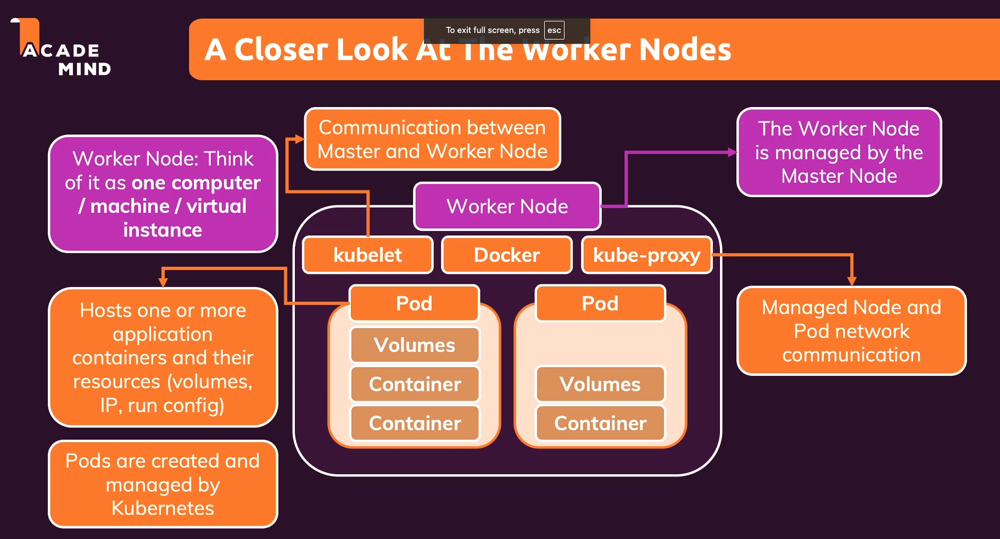

# Worker Node trong Kubernetes

## 1. Giới thiệu về Worker Node

Worker Node là máy chủ hoặc máy ảo (ví dụ như EC2 instance) nơi các Pod được chạy. Các worker nodes được quản lý bởi Master Node, là trung tâm điều khiển của Kubernetes.

Worker Node có thể là một máy tính vật lý hoặc ảo với các tài nguyên tính toán như CPU và bộ nhớ.

## 2. Pods

Pod là đơn vị quản lý nhỏ nhất trong Kubernetes. Mỗi Pod có thể chứa một hoặc nhiều container.

Pod chứa các container và tài nguyên cần thiết cho container đó như cấu hình và volume.

Nếu một container trong pod gặp sự cố, Kubernetes có thể tự động thay thế nó, và các pod có thể được tạo hoặc xóa tự động bởi Master Node.

## 3. Quản lý Pods và Containers

Pods có thể chứa nhiều container nếu chúng cần làm việc cùng nhau, chẳng hạn như các container cần chia sẻ tài nguyên hoặc dữ liệu.

Worker Nodes không chỉ chạy một loại task cụ thể. Chúng có thể chạy nhiều pod với các container khác nhau thực hiện các nhiệm vụ khác nhau, giống như khi bạn chạy nhiều container khác nhau trên một máy tính cá nhân bằng docker run hoặc docker-compose.

## 4. Các phần mềm cần thiết trên Worker Node

### Docker
- Được cài đặt trên worker node để tạo và chạy containers trong pods.

### Kubelet
- Là phần mềm chịu trách nhiệm giao tiếp giữa worker node và master node.
- Giúp master node quản lý các pods và containers trên worker node.

### Proxy
- Phần mềm này quản lý lưu lượng truy cập vào và ra khỏi worker node.
- Đảm bảo rằng chỉ lưu lượng hợp lệ mới có thể vào và ra khỏi pod.

## 5. Tự động hóa với Kubernetes

Với Kubernetes, bạn chỉ cần định nghĩa trạng thái mong muốn của hệ thống. Các nhà cung cấp đám mây như AWS có các dịch vụ hỗ trợ bạn cung cấp cấu hình Kubernetes, và AWS sẽ tự động thiết lập các instance và cài đặt phần mềm cần thiết cho bạn.

Điều này giúp bạn không cần phải lo lắng về việc cài đặt và cấu hình phần mềm trên các máy chủ mà chỉ cần biết về cách Kubernetes hoạt động và cấu hình của bạn.

## 6. Tóm tắt

Worker Nodes là máy chủ thực thi các Pod, nơi các containers được chạy. Kubernetes giúp tự động hóa việc quản lý các pods, giám sát và khôi phục chúng khi gặp sự cố, đồng thời phân phối tải và điều chỉnh số lượng container khi cần thiết.

Khi sử dụng các dịch vụ đám mây như AWS, bạn có thể dễ dàng triển khai Kubernetes mà không cần phải lo lắng về việc cấu hình máy chủ, vì AWS sẽ lo phần cài đặt phần mềm cho bạn. 