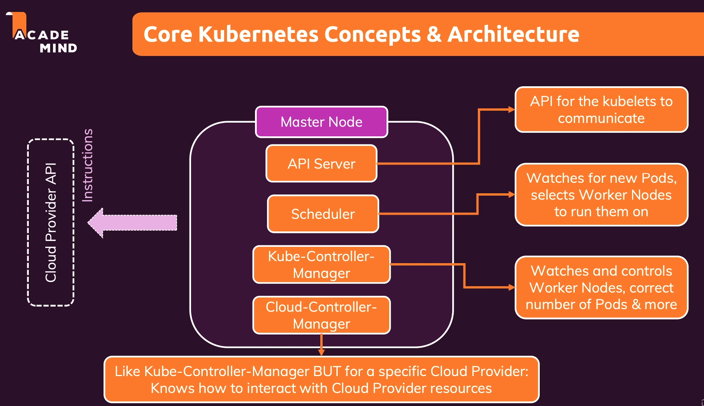

# Master Node trong Kubernetes

## 1. Giới thiệu

Master Node là trung tâm điều khiển của Kubernetes, nơi chứa các dịch vụ quan trọng giúp quản lý và điều phối toàn bộ hệ thống. Bài giảng này sẽ giải thích chi tiết về Master Node và các phần mềm quan trọng chạy trên đó.

## 2. Các thành phần chính

### 2.1 API Server
- Là dịch vụ quan trọng nhất trên master node
- Điểm giao tiếp giữa worker nodes và master node
- Xử lý và truyền thông tin đến các worker nodes
- Xử lý các yêu cầu quản lý tài nguyên

### 2.2 Scheduler
- Giám sát các pods và quyết định nơi tạo pod mới
- Lựa chọn worker node phù hợp để khởi tạo pod
- Hoạt động trong các trường hợp:
  - Pod cũ bị lỗi
  - Cần mở rộng (scaling) hệ thống
  - Cân bằng tải giữa các worker nodes

### 2.3 Kube-Controller Manager
- Quản lý số lượng pod trong hệ thống
- Đảm bảo các pod chạy đúng số lượng mong muốn
- Làm việc chặt chẽ với scheduler và API server
- Duy trì trạng thái mong muốn của hệ thống

### 2.4 Cloud-Controller Manager
- Phiên bản đặc biệt của Kube-Controller Manager
- Dành cho các nhà cung cấp đám mây (AWS, Azure, v.v.)
- Truyền tải hướng dẫn đến nhà cung cấp đám mây
- Quản lý tài nguyên trên nền tảng đám mây

## 3. Tóm tắt

Master Node là trung tâm điều khiển của Kubernetes, với các dịch vụ như:
- API Server: Điểm giao tiếp chính
- Scheduler: Điều phối và phân bổ pods
- Kube-Controller Manager: Quản lý trạng thái hệ thống
- Cloud-Controller Manager: Tích hợp với dịch vụ đám mây

## 4. Khái niệm tổng quan

Đây là cái nhìn tổng quan về cấu trúc chính của Kubernetes. Các khái niệm này sẽ trở nên rõ ràng hơn khi bạn thực hành và làm việc với Kubernetes trong các phần sau của khóa học.

## 5. Kết luận

Master Node chịu trách nhiệm:
- Điều khiển và giám sát toàn bộ hệ thống
- Quản lý worker nodes
- Tạo và điều phối các pods
- Kết nối với các dịch vụ đám mây
- Duy trì trạng thái mong muốn của hệ thống 