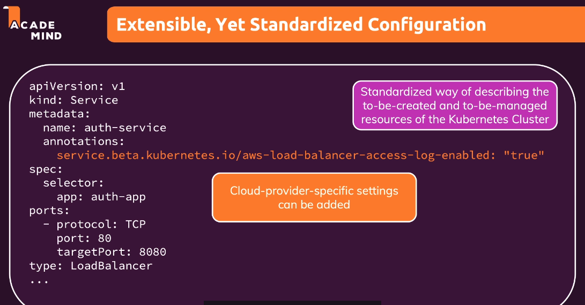

# Phần 11: Bắt đầu với Kubernetes

## Giới thiệu

Chào mừng bạn đến với phần Kubernetes trong lộ trình học Docker & Kubernetes. Phần này đánh dấu sự bắt đầu của hành trình tìm hiểu về container orchestration và triển khai quy mô lớn.

## Thách thức khi triển khai Docker containers thủ công

Khi triển khai Docker containers trên các máy chủ ảo (ví dụ: EC2 instances), bạn sẽ gặp phải một số vấn đề:

1. **Quản lý sự cố thủ công**
   - Container có thể bị sập hoặc không sử dụng được
   - Cần theo dõi và khởi động lại thủ công khi có sự cố
   - Không khả thi để giám sát 24/7 cho các ứng dụng lớn

2. **Vấn đề về mở rộng quy mô**
   - Cần mở rộng số lượng container khi lưu lượng tăng
   - Phải giảm số lượng container khi lưu lượng giảm
   - Khó khăn trong việc phân phối tải đồng đều

3. **Quản lý tải và phân phối lưu lượng**
   - Khó khăn trong việc cân bằng tải giữa các container
   - Có thể xảy ra tình trạng container bị quá tải
   - Thiếu cơ chế tự động phân phối lưu lượng

## Kubernetes là gì?

Kubernetes là một hệ thống mã nguồn mở giúp tự động hóa việc triển khai, mở rộng, và quản lý các ứng dụng containerized. Nó không phải là một dịch vụ của nhà cung cấp đám mây, mà là một framework giúp quản lý containers trên nhiều nền tảng đám mây.

Kubernetes giúp bạn:
- Định nghĩa các yêu cầu về triển khai
- Tự động mở rộng containers
- Giám sát và thay thế containers khi bị lỗi

### Lợi ích của Kubernetes

1. **Độc lập với nhà cung cấp đám mây**
   - Mã nguồn mở, có thể sử dụng với bất kỳ nhà cung cấp đám mây nào
   - Có thể tự cài đặt trên các máy chủ riêng
   - Hỗ trợ đa nền tảng
   - Kết hợp đơn giản khi khai báo tích hợp Cloud vào kubernetes
   

2. **Tính chuẩn hóa**
   - Một file cấu hình duy nhất cho toàn bộ triển khai
   - Định nghĩa số lượng containers, yêu cầu tự động thay thế
   - Có thể sử dụng lại trên nhiều môi trường
   - Chỉ cần điều chỉnh một số tham số riêng biệt của nhà cung cấp

### Kubernetes không phải là gì

1. **Không phải là dịch vụ đám mây**
   - Không phải dịch vụ của AWS, Azure hay bất kỳ nhà cung cấp nào
   - Là dự án mã nguồn mở có thể chạy trên nhiều nền tảng

2. **Không thay thế Docker**
   - Là công cụ bổ sung cho Docker
   - Giúp quản lý containers Docker trên quy mô lớn
   - Hỗ trợ nhiều máy chủ

3. **Không phải dịch vụ trả phí**
   - Bản thân Kubernetes là miễn phí
   - Chỉ phải trả phí cho tài nguyên đám mây khi sử dụng dịch vụ của nhà cung cấp

### So sánh với Docker-Compose

| Đặc điểm | Docker-Compose | Kubernetes |
|----------|---------------|------------|
| Quy mô | Một máy tính | Nhiều máy chủ |
| Mục đích | Quản lý ứng dụng container trên một máy | Triển khai và quản lý containers trên nhiều máy |
| Tính năng | Cấu hình đơn giản | Hệ thống quản lý container toàn diện |
| Tự động hóa | Hạn chế | Nhiều tính năng tự động hóa |
| Cân bằng tải | Không hỗ trợ | Hỗ trợ mạnh mẽ |
| Mở rộng quy mô | Thủ công | Tự động |

## Tại sao cần Kubernetes?

Kubernetes giải quyết các thách thức trên thông qua:

1. **Tự động hóa và quản lý quy mô lớn**
   - Tự động triển khai và quản lý containers
   - Không cần giám sát thủ công
   - Hỗ trợ mở rộng quy mô tự động

2. **Quản lý sự cố tự động**
   - Tự động phát hiện và thay thế containers bị sự cố
   - Đảm bảo tính sẵn sàng cao cho ứng dụng
   - Giảm thiểu thời gian ngừng hoạt động

3. **Cân bằng tải thông minh**
   - Tự động phân phối lưu lượng HTTP đồng đều
   - Tránh tình trạng container bị quá tải
   - Tối ưu hóa việc sử dụng tài nguyên

## Cấu trúc khóa học

Phần này được chia thành nhiều module:

1. **Kiến thức cơ bản về Kubernetes**
   - Hiểu về các thách thức trong container orchestration
   - Kiến trúc và các thành phần của Kubernetes
   - Các khái niệm và thuật ngữ cốt lõi

2. **Module thực hành**
   - Thiết lập môi trường Kubernetes cục bộ
   - Làm việc với các đối tượng Kubernetes
   - Triển khai ứng dụng
   - Quản lý tài nguyên
   - Mạng trong Kubernetes

3. **Triển khai lên đám mây**
   - Triển khai lên các nhà cung cấp đám mây thực tế
   - Các phương pháp hay nhất cho môi trường production
   - Giám sát và bảo trì

## Yêu cầu tiên quyết

Trước khi bắt đầu phần này, bạn nên có:
- Hiểu biết cơ bản về Docker và containers
- Quen thuộc với giao diện dòng lệnh
- Kiến thức cơ bản về các khái niệm mạng

## Mục tiêu học tập

Khi kết thúc phần này, bạn sẽ có thể:
- Hiểu kiến trúc và các thành phần của Kubernetes
- Triển khai và quản lý các ứng dụng được container hóa
- Mở rộng quy mô ứng dụng hiệu quả
- Triển khai các giải pháp đảm bảo tính sẵn sàng cao
- Quản lý tài nguyên hiệu quả
- Triển khai lên môi trường đám mây

## Bắt đầu

Để bắt đầu hành trình Kubernetes của bạn:
1. Xem lại kiến thức cơ bản trong phần này
2. Thiết lập môi trường Kubernetes cục bộ
3. Làm theo các bài tập thực hành
4. Thực hành triển khai các ứng dụng mẫu

## Các bước tiếp theo

Sau khi hoàn thành phần này, bạn sẽ sẵn sàng để tìm hiểu sâu hơn về:
- Các khái niệm cốt lõi của Kubernetes (Phần 12)
- Dữ liệu và Volumes trong Kubernetes (Phần 13)
- Mạng trong Kubernetes (Phần 14)
- Triển khai Kubernetes trên AWS EKS (Phần 15)

## Tài nguyên tham khảo

- [Tài liệu chính thức của Kubernetes](https://kubernetes.io/docs/home/)
- [Kho lưu trữ GitHub của Kubernetes](https://github.com/kubernetes/kubernetes)
- [Cộng đồng Kubernetes](https://kubernetes.io/community/)
