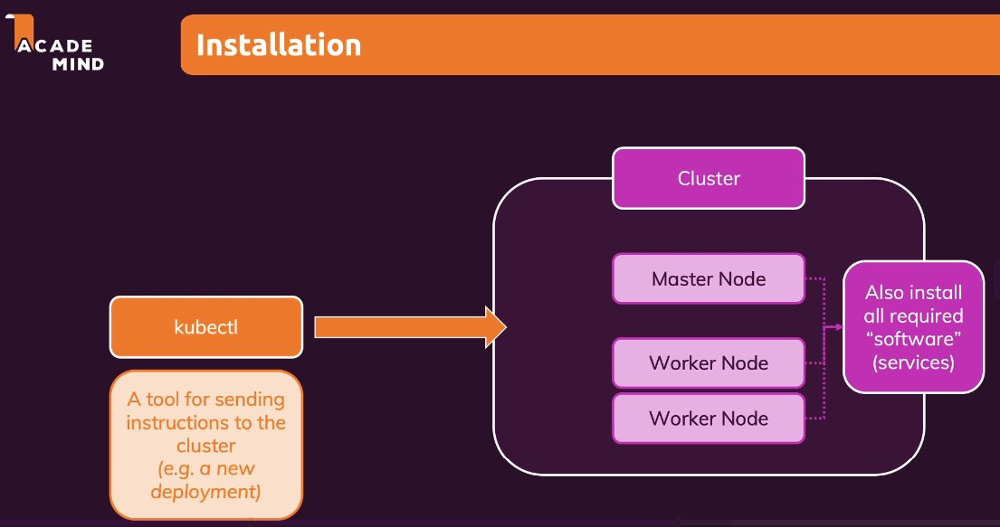

# 12.1 Thiết lập Cluster Kubernetes

## 1. Thiết lập Cluster Kubernetes

### 1.1 Cấu trúc Cluster

Cluster Kubernetes bao gồm:

#### Master Node
- Quản lý và điều phối các tác vụ trong Kubernetes
- Chứa các dịch vụ quan trọng:
  - API server
  - Scheduler
  - Controller Manager
  - etcd

#### Worker Nodes
- Chạy các Pods chứa containers
- Thực thi ứng dụng
- Cài đặt các thành phần:
  - Docker
  - kubelet (giao tiếp với master node)

### 1.2 Cài đặt phần mềm

#### Trên Master Node
- API server
- Scheduler
- Controller Manager
- etcd
- Các công cụ quản lý cluster

#### Trên Worker Nodes
- Docker
- kubelet
- kube-proxy
- Các công cụ quản lý container

## 2. Công cụ kubectl

### 2.1 Giới thiệu
- Công cụ dòng lệnh chính thức của Kubernetes
- Giao tiếp với master node
- Quản lý các đối tượng Kubernetes:
  - Tạo
  - Thay đổi
  - Xóa
  - Giám sát

### 2.2 Vai trò
- Không phải là phần của master node
- Không phải là API server
- Là công cụ giao tiếp với cluster

### 2.3 Ví dụ minh họa
- kubectl như Tổng thống (giao lệnh)
- master node như tướng quân (thực thi lệnh)
- worker nodes như binh lính (thực hiện công việc)

## 3. Minikube

### 3.1 Giới thiệu
- Công cụ tạo cluster thử nghiệm
- Chạy trên máy tính cá nhân
- Tạo virtual machine để mô phỏng cluster

### 3.2 Đặc điểm
- Tạo cluster với một node duy nhất
- Kết hợp master node và worker node
- Lý tưởng cho môi trường phát triển
- Không phù hợp cho production

### 3.3 Cài đặt
- Hỗ trợ Linux, macOS, Windows
- Cần cài đặt cùng với kubectl
- Hướng dẫn chi tiết trong các bài giảng tiếp theo

## 4. Quy trình cài đặt

### 4.1 Yêu cầu
- Cài đặt kubectl
- Cài đặt Minikube
- Cấu hình môi trường thử nghiệm

### 4.2 Các bước
1. Cài đặt kubectl
2. Cài đặt Minikube
3. Khởi động cluster
4. Kiểm tra kết nối
5. Bắt đầu thực hành

## 5. Tóm tắt

### 5.1 Điểm chính
- Cluster Kubernetes cần master node và worker nodes
- kubectl là công cụ quản lý cluster
- Minikube giúp thử nghiệm trên máy tính cá nhân

### 5.2 Lợi ích
- Môi trường thử nghiệm an toàn
- Học tập và thực hành dễ dàng
- Chuẩn bị cho môi trường production

### 5.3 Kết luận
Bài giảng giúp bạn:
- Hiểu cấu trúc cluster Kubernetes
- Chuẩn bị môi trường thử nghiệm
- Sẵn sàng cho các bài thực hành tiếp theo

## 6. Hướng dẫn thực hành
Để xem hướng dẫn chi tiết về cách cài đặt và cấu hình Kubernetes trên các hệ điều hành khác nhau, vui lòng tham khảo file [handson.md](./handson.md). 