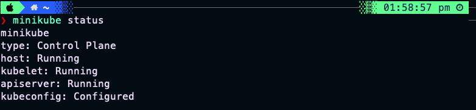

# Hướng dẫn thực hành cài đặt Kubernetes

## 1. Cài đặt trên Mac

### 1.1 Kiểm tra yêu cầu hệ thống
- Mở Terminal và chạy lệnh:
  ```bash
  sysctl -a | grep -E --color 'machdep.cpu.features|VMX'
  ```
- Nếu thấy từ khóa "VMX" trong kết quả, máy tính của bạn đáp ứng yêu cầu cài đặt Kubernetes

### 1.2 Cài đặt kubectl
1. Cài đặt Homebrew (nếu chưa có):
   ```bash
   /bin/bash -c "$(curl -fsSL https://raw.githubusercontent.com/Homebrew/install/HEAD/install.sh)"
   ```

2. Cài đặt kubectl:
   ```bash
   brew install kubectl
   ```

3. Kiểm tra phiên bản:
   ```bash
   kubectl version --client
   ```

### 1.3 Cài đặt Minikube
1. Cài đặt VirtualBox:
   - Tải và cài đặt VirtualBox từ trang chủ: https://www.virtualbox.org/

2. Cài đặt Minikube:
   ```bash
   brew install minikube
   ```

3. Kiểm tra phiên bản:
   ```bash
   minikube version
   ```

### 1.4 Khởi động Minikube
1. Khởi động cluster:
   ```bash
   minikube start --driver=virtualbox
   ```
   
   Với Mac M1 có thể start với Docker Desktop:
   ```bash
   open -a Docker # mo docker desktop
   minikube start --driver=docker
   ```
	

2. Kiểm tra trạng thái:
   ```bash
   minikube status
   ```
   

3. Mở dashboard:
   ```bash
   minikube dashboard
   ```
     
   Một thông báo đề xuất rằng một số tính năng của Dashboard yêu cầu metrics-server để có thể hoạt động đầy đủ. 

   

   Trả về URL mình có thể truy cập được dashboard rồi!
   

### 1.5 Kiểm tra cài đặt
1. Kiểm tra cluster:
   ```bash
   kubectl cluster-info
   ```

2. Kiểm tra nodes:
   ```bash
   kubectl get nodes
   ```

3. Kiểm tra pods:
   ```bash
   kubectl get pods -A
   ```

### 1.6 Lưu ý quan trọng
- Đảm bảo máy tính có đủ tài nguyên (RAM, CPU) để chạy Minikube
- VirtualBox cần được cài đặt trước khi cài đặt Minikube
- Nếu gặp lỗi, kiểm tra logs:
  ```bash
   minikube logs
   ```

### 1.7 Dừng và xóa cluster
1. Dừng cluster:
   ```bash
   minikube stop
   ```

2. Xóa cluster:
   ```bash
   minikube delete
   ```

3. Xóa tất cả dữ liệu:
   ```bash
   minikube delete --all
   ```

## 2. Cài đặt trên Windows

### 2.1 Yêu cầu hệ thống
- Windows 10 hoặc Windows 11
- Hyper-V hoặc VirtualBox
- PowerShell hoặc Command Prompt với quyền Administrator

### 2.2 Cài đặt kubectl
1. Tải kubectl từ trang chủ Kubernetes
2. Thêm vào PATH
3. Kiểm tra cài đặt:
   ```powershell
   kubectl version --client
   ```

### 2.3 Cài đặt Minikube
1. Tải và cài đặt Minikube
2. Cài đặt VirtualBox hoặc Hyper-V
3. Khởi động cluster:
   ```powershell
   minikube start --driver=virtualbox
   ```

## 3. Cài đặt trên Linux

### 3.1 Yêu cầu hệ thống
- Ubuntu 18.04 trở lên
- KVM hoặc VirtualBox
- 2GB RAM trở lên

### 3.2 Cài đặt kubectl
1. Cài đặt thông qua apt:
   ```bash
   sudo apt-get update
   sudo apt-get install -y kubectl
   ```

### 3.3 Cài đặt Minikube
1. Tải và cài đặt Minikube
2. Cài đặt KVM hoặc VirtualBox
3. Khởi động cluster:
   ```bash
   minikube start --driver=kvm2
   ```

## 4. Xử lý lỗi thường gặp

### 4.1 Lỗi khởi động Minikube
- Kiểm tra logs:
  ```bash
  minikube logs
  ```
- Kiểm tra trạng thái:
  ```bash
  minikube status
  ```
- Xóa và tạo lại cluster:
  ```bash
  minikube delete
  minikube start
  ```

### 4.2 Lỗi kết nối kubectl
- Kiểm tra cấu hình:
  ```bash
  kubectl config view
  ```
- Đặt context:
  ```bash
  kubectl config use-context minikube
  ```

### 4.3 Lỗi tài nguyên
- Tăng bộ nhớ:
  ```bash
  minikube config set memory 4096
  ```
- Tăng CPU:
  ```bash
  minikube config set cpus 2
  ``` 