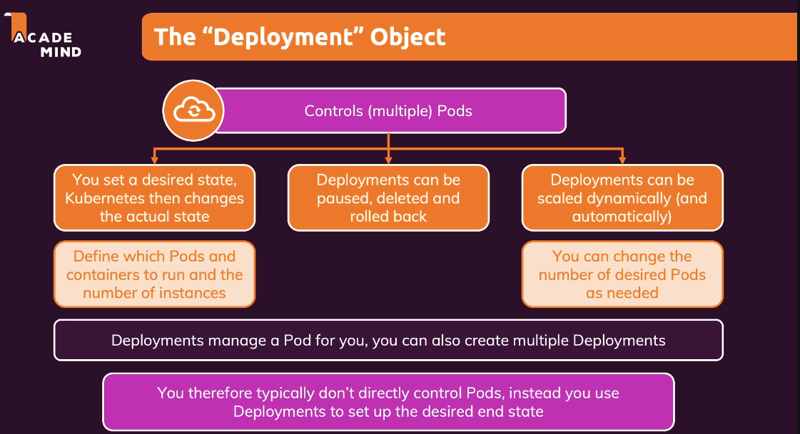

# Deployment Object trong Kubernetes

## 1. Giới thiệu về Deployment

### 1.1 Khái niệm
- Đối tượng quan trọng trong Kubernetes
- Quản lý và triển khai ứng dụng container
- Tự động tạo và quản lý Pods
- Không cần tạo Pods thủ công

### 1.2 Vai trò
- Quản lý nhiều Pods cùng lúc
- Định nghĩa số lượng Pods và containers
- Tự động điều chỉnh trạng thái hệ thống
- Quản lý tài nguyên trên worker nodes

## 2. Chức năng của Deployment

### 2.1 Quản lý Pods
- Tạo và quản lý nhiều Pods
- Định nghĩa số lượng Pods mong muốn
- Tự động điều chỉnh trạng thái
- Phân bổ tài nguyên tự động

### 2.2 Tự động hóa
- Tự động tạo Pods
- Tự động thay thế Pods lỗi
- Tự động điều chỉnh số lượng
- Tự động phân bổ tài nguyên

### 2.3 Quản lý tài nguyên
- Phân bổ bộ nhớ
- Phân bổ CPU
- Tối ưu hóa tài nguyên
- Cân bằng tải tự động

## 3. Tính năng nâng cao

### 3.1 Rollback
- Quay lại phiên bản trước
- Không cần sửa mã nguồn
- Dễ dàng khôi phục
- Giảm thời gian downtime

### 3.2 Autoscaling
- Tự động điều chỉnh số lượng Pods
- Dựa trên lưu lượng truy cập
- Dựa trên mức độ sử dụng CPU
- Tự động mở rộng/co lại

### 3.3 Quản lý phiên bản
- Quản lý nhiều phiên bản
- Dễ dàng chuyển đổi
- Hỗ trợ A/B testing
- Kiểm soát phiên bản

## 4. Thực hành với Deployment

### 4.1 Tạo Deployment
- Sử dụng kubectl
- Định nghĩa YAML
- Cấu hình Pods
- Cấu hình containers

### 4.2 Quản lý Deployment
- Pause Deployment
- Xóa Deployment
- Rollback Deployment
- Cập nhật Deployment

### 4.3 Giám sát
- Kiểm tra trạng thái
- Xem logs
- Theo dõi metrics
- Cảnh báo tự động

## 5. Tóm tắt

### 5.1 Điểm chính
- Deployment quản lý Pods tự động
- Hỗ trợ rollback và autoscaling
- Dễ dàng quản lý phiên bản
- Tự động hóa quy trình

### 5.2 Lợi ích
- Giảm công việc thủ công
- Tăng độ tin cậy
- Dễ dàng mở rộng
- Hỗ trợ nhiều tính năng

### 5.3 Kết luận
- Deployment là công cụ mạnh mẽ
- Tự động hóa quy trình triển khai
- Đảm bảo ứng dụng hoạt động ổn định
- Giảm thời gian quản lý 