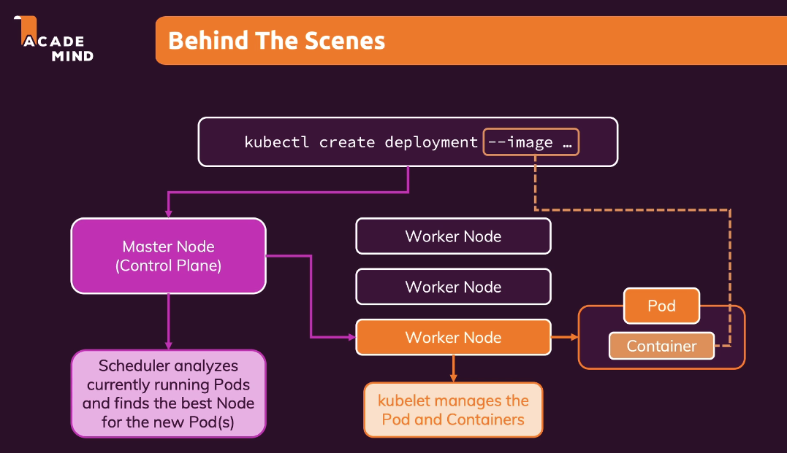
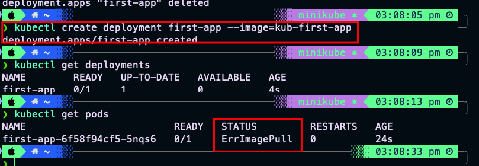
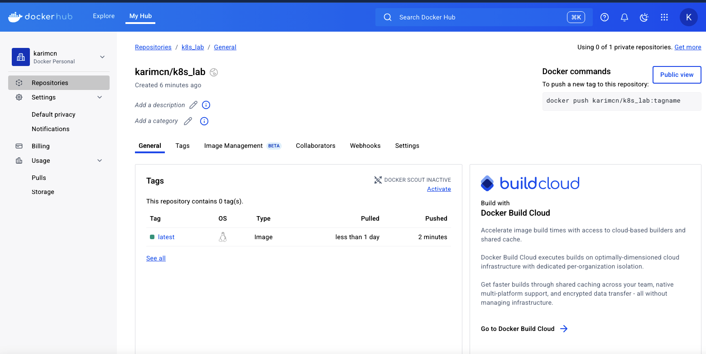
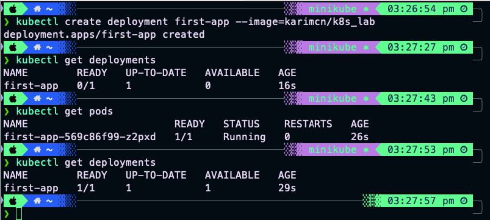
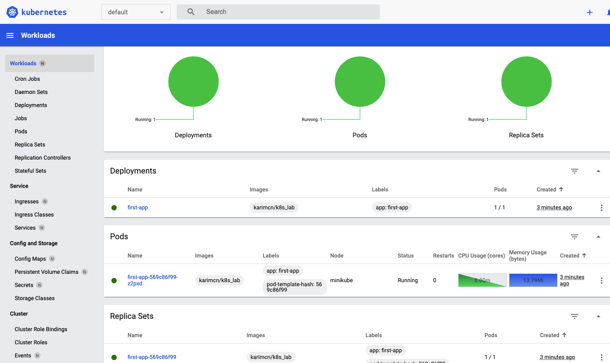

# Hướng dẫn thực hành Deployment Object

## Tổng quan về quá trình tạo và triển khai Deployment
---
### 1. Lệnh kubectl create deployment
- Lệnh `kubectl create deployment` tạo một Deployment object trong Kubernetes
- Yêu cầu được gửi tới Master Node (Control Plane) của cluster
- Master Node chịu trách nhiệm tạo và quản lý các tài nguyên trong cluster, bao gồm Pods


### 2. Master Node và Scheduler
- Scheduler trên Master Node phân tích các Pod hiện tại
- Tìm Worker Node thích hợp để chạy Pod mới
- Pod mới được phân phối đến Worker Node với:
  - Ít công việc nhất
  - Hoặc đủ tài nguyên để chạy Pod

### 3. Worker Node và Kubelet
- Kubelet trên Worker Node quản lý Pod mới
- Khởi động Container trong Pod
- Giám sát tình trạng sức khỏe của Pod
- Đảm bảo container trong Pod đang chạy và hoạt động đúng

### 4. Quá trình Tạo Pod và Container
- Kubernetes tự động tạo và phân phối Pods đến các Worker Node
- Pods được quản lý và giám sát bởi kubelet
- Toàn bộ quá trình được tự động hóa và quản lý bởi Kubernetes

---
# HANDON LAB
## 1. Chuẩn bị ứng dụng Node.js

### 1.1 Source Code
Source code của ứng dụng Node.js đã được chuẩn bị sẵn trong thư mục `./docs/kub-action`:
- `app.js`: Ứng dụng Node.js với 2 endpoints (/nothing và /error)
- `package.json`: Cấu hình dependencies
- `Dockerfile`: Cấu hình để build Docker image

## 2. Tạo Docker Image

### 2.1 Build Docker Image  

```bash
# Di chuyển đến thư mục source code
cd ./docs/kub-action

# Build image
docker build -t kub-first-app .

# Tag image cho Docker Hub
docker tag kub-first-app yourusername/kub-first-app

# Push lên Docker Hub
docker push yourusername/kub-first-app
```
Nhớ phải push images lên repo gì đó nhé!, dể lúc tạp deployment cho kubectl sẽ bị lỗi pullimage  


Sau khi push images lên dockerhub bạn sẽ thấy version như thế này   
Do tạo repo name là k8s_lab nên đành sửa images tag bên dưới là karimcn/k8s_lab để push lên luôn ^^



## 3. Thiết lập Kubernetes Cluster

### 3.1 Kiểm tra Minikube
```bash
# Kiểm tra trạng thái
minikube status

# Khởi động cluster nếu cần
minikube start --driver=docker
```

### 3.2 Kiểm tra kubectl
```bash
# Kiểm tra kết nối
kubectl cluster-info

# Kiểm tra nodes
kubectl get nodes
```

## 4. Tạo Deployment

### 4.1 Tạo Deployment từ Docker Hub Image 
```bash
# Tạo deployment
kubectl create deployment first-app --image=yourusername/kub-first-app

# Kiểm tra deployment
kubectl get deployments
kubectl get pods
```


Mở ''' minikube dashboard '''  Sẽ thấy ứng dụng đang chạy 



