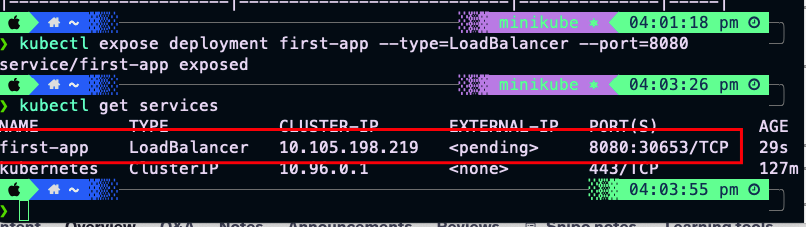
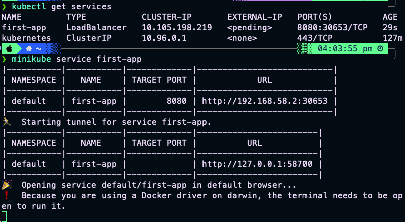

# Thực hành với Service Object

## 1. Chuẩn bị môi trường

***Tiếp theo của deployment-handson.md , nếu bạn chưa làm phần deployment hãy làm lại nhé!***

## 2. Tạo Service

### 2.1 Tạo Service từ Deployment
```bash
# Tạo service với loại LoadBalancer
kubectl expose deployment first-app --type=LoadBalancer --port=8080

# Kiểm tra service
kubectl get services
```
Tôi tạo service expose từ deployment. Chúng ta đều thấy có Cluster-IP rôi nè 
 
nên nhớ rằng minikube cũng chỉ là máy ảo ở mạng local của chúng ta   
Và EXTERNAL-IP đang còn trạng thái **pending** . Để mở service first-app và có  EXTERNNAL IP ta làm như sau  

```bash
minikube service first-app 
```
 

### 2.2 Kiểm tra chi tiết Service
```bash
# Xem chi tiết service
kubectl describe service first-app

# Kiểm tra endpoints
kubectl get endpoints first-app
```

## 3. Truy cập Service

### 3.1 Truy cập qua Minikube
```bash
# Lấy URL của service
minikube service first-app --url

# Hoặc mở trình duyệt tự động
minikube service first-app
```

### 3.2 Kiểm tra ứng dụng
```bash
# Sử dụng curl để kiểm tra
curl http://<service-ip>:<port>/nothing
```


## 6. Lưu ý quan trọng

### 6.1 Về Service
- Luôn kiểm tra type của service (ClusterIP, NodePort, LoadBalancer)
- Đảm bảo port mapping đúng giữa service và pods
- Kiểm tra endpoints để đảm bảo pods đang chạy

### 6.2 Về Truy cập
- Trên Minikube, sử dụng `minikube service` để truy cập
- Trên cloud, kiểm tra external IP của LoadBalancer
- Đảm bảo security groups và network policies cho phép truy cập

### 6.3 Về Debug
- Sử dụng `kubectl describe` để xem chi tiết
- Kiểm tra logs khi có lỗi
- Sử dụng `kubectl get endpoints` để kiểm tra pods 